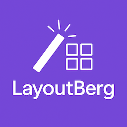

# LayoutBerg - AI Layout Designer for WordPress



**LayoutBerg** is an AI-powered layout designer that seamlessly integrates with the WordPress Gutenberg editor. Generate complete, responsive layouts using natural language prompts, powered by OpenAI's GPT models.

## Features

- 🤖 **AI-Powered Layout Generation** - Create layouts using natural language prompts
- 🎯 **Native Gutenberg Integration** - Works seamlessly with WordPress block editor
- 🎨 **Smart Templates** - Pre-designed templates for common layout needs
- 📱 **Responsive Design** - All generated layouts are mobile-friendly
- ♿ **Accessibility First** - Generated layouts follow WCAG guidelines
- 🚀 **Performance Optimized** - Intelligent caching and optimization
- 🔒 **Secure** - API keys are encrypted and stored securely

## Requirements

- WordPress 6.0 or higher
- PHP 8.1 or higher
- MySQL 5.7 or higher
- OpenAI API key

## Installation

1. Download the plugin ZIP file
2. Go to WordPress Admin > Plugins > Add New
3. Click "Upload Plugin" and select the ZIP file
4. Activate the plugin
5. Go to LayoutBerg > Settings to configure your OpenAI API key

## Quick Start

1. **Configure API Key**
   - Navigate to LayoutBerg > Settings
   - Enter your OpenAI API key
   - Select your preferred AI model

2. **Generate Your First Layout**
   - Create or edit a page/post
   - Click the LayoutBerg button in the toolbar
   - Enter a prompt like "Create a hero section with headline and CTA"
   - Click Generate and watch the magic happen!

3. **Use Templates**
   - Browse pre-designed templates
   - Customize them to match your needs
   - Save your own templates for reuse

## Usage

### Natural Language Prompts

LayoutBerg understands natural language. Here are some example prompts:

- "Create a hero section with a large headline, subtext, and two buttons"
- "Design a 3-column features section with icons"
- "Build a testimonials grid with customer reviews"
- "Make a contact section with address and contact form"

### Template System

Save and reuse your favorite layouts:

1. Generate a layout you like
2. Click "Save as Template"
3. Give it a name and category
4. Access it later from Templates menu

### Customization Options

- **Style**: Modern, Classic, Minimal, Bold
- **Colors**: Brand colors, Monochrome, Vibrant, Pastel
- **Layout**: Single column, Sidebar, Grid, Asymmetric
- **Density**: Spacious, Balanced, Compact

## API Configuration

### Getting an OpenAI API Key

1. Visit [OpenAI Platform](https://platform.openai.com)
2. Sign up or log in
3. Navigate to API Keys
4. Create a new API key
5. Copy and paste into LayoutBerg settings

### Supported Models

- **GPT-3.5 Turbo** - Fast and affordable
- **GPT-4** - Most capable (Pro version)
- **GPT-4 Turbo** - Fast and capable (Pro version)

## Troubleshooting

### Common Issues

**Layout generation fails**
- Check your API key is valid
- Ensure you have API credits
- Check your internet connection

**Blocks not rendering correctly**
- Clear your browser cache
- Deactivate conflicting plugins
- Check theme compatibility

**Performance issues**
- Enable caching in settings
- Use a smaller AI model
- Reduce max tokens

## Developer Documentation

### Hooks and Filters

```php
// Modify allowed blocks
add_filter('layoutberg_allowed_blocks', function($blocks) {
    $blocks[] = 'my-plugin/custom-block';
    return $blocks;
});

// Customize AI prompt
add_filter('layoutberg_generation_prompt', function($prompt, $options) {
    return $prompt . ' Add custom instructions here.';
}, 10, 2);
```

### REST API Endpoints

- `POST /wp-json/layoutberg/v1/generate` - Generate layout
- `GET /wp-json/layoutberg/v1/templates` - Get templates
- `POST /wp-json/layoutberg/v1/templates` - Save template

## Support

- **Documentation**: [docs.dotcamp.com/layoutberg](https://docs.dotcamp.com/layoutberg)
- **Support Forum**: [wordpress.org/support/plugin/layoutberg](https://wordpress.org/support/plugin/layoutberg)
- **Bug Reports**: [github.com/dotcamp/layoutberg/issues](https://github.com/dotcamp/layoutberg/issues)

## License

This plugin is licensed under the GPL v2 or later.

## Credits

Developed by [DotCamp](https://dotcamp.com)

## Changelog

### 1.0.0
- Initial release
- Basic layout generation
- Template system
- Gutenberg integration