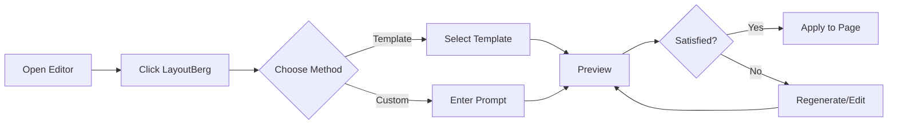
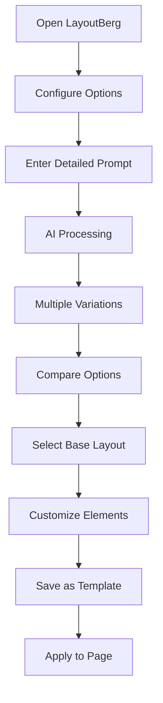

# LayoutBerg - AI Layout Designer for WordPress
## Plugin Development Outline

---

## 📋 Table of Contents
1. [Plugin Overview](#plugin-overview)
2. [Technical Specifications](#technical-specifications)
3. [Core Features](#core-features)
4. [User Interface & Experience](#user-interface--experience)
5. [Technical Architecture](#technical-architecture)
6. [API Integration](#api-integration)
7. [Security Implementation](#security-implementation)
8. [Pricing & Licensing](#pricing--licensing)
9. [Development Roadmap](#development-roadmap)
10. [Documentation Structure](#documentation-structure)

---

## Plugin Overview

### Basic Information
- **Plugin Name:** LayoutBerg - AI Layout Designer
- **Developer:** DotCamp
- **Version:** 1.0.0
- **WordPress Compatibility:** 6.0+
- **PHP Requirement:** 8.1+
- **License:** GPL v2 or later / Commercial
- **Text Domain:** layoutberg
- **Domain Path:** /languages

### Plugin Description
LayoutBerg is an AI-powered layout designer that seamlessly integrates with the WordPress Gutenberg editor. It uses OpenAI's GPT models to generate complete, responsive layouts using native Gutenberg blocks, enabling users to create professional designs through natural language prompts.

### Unique Selling Points
- Native Gutenberg integration - no proprietary page builder
- Natural language layout generation
- Intelligent block pattern creation
- Real-time preview and editing
- SEO and accessibility optimized outputs
- Multi-model AI support (GPT-3.5, GPT-4)

---

## Technical Specifications

### System Requirements
```yaml
Minimum Requirements:
  WordPress: 6.0
  PHP: 8.1
  MySQL: 5.7
  Memory Limit: 256MB
  Max Execution Time: 60 seconds

Recommended Requirements:
  WordPress: Latest
  PHP: 8.2+
  MySQL: 8.0+
  Memory Limit: 512MB
  Max Execution Time: 120 seconds
  Redis/Memcached: Available
```

### File Structure
```
layoutberg/
├── layoutberg.php                 # Main plugin file
├── uninstall.php                 # Clean uninstallation
├── README.md                     # GitHub readme
├── readme.txt                    # WordPress.org readme
├── LICENSE                       # GPL v2 license
├── composer.json                 # PHP dependencies
├── package.json                  # Node dependencies
├── webpack.config.js             # Build configuration
│
├── includes/                     # PHP classes and functions
│   ├── class-layoutberg.php      # Main plugin class
│   ├── class-activator.php       # Activation hooks
│   ├── class-deactivator.php     # Deactivation hooks
│   ├── class-admin.php           # Admin functionality
│   ├── class-public.php          # Frontend functionality
│   ├── class-api-client.php      # OpenAI API wrapper
│   ├── class-block-generator.php # Block generation logic
│   ├── class-template-manager.php # Template system
│   ├── class-cache-manager.php   # Caching layer
│   └── traits/                   # Reusable traits
│
├── admin/                        # Admin-specific files
│   ├── js/                      # Admin JavaScript
│   ├── css/                     # Admin styles
│   └── partials/                # Admin view templates
│
├── public/                       # Frontend files
│   ├── js/                      # Public JavaScript
│   └── css/                     # Public styles
│
├── src/                         # Source files for build
│   ├── blocks/                  # Gutenberg block sources
│   │   ├── ai-layout/          # Main AI layout block
│   │   └── components/         # Reusable components
│   ├── editor/                 # Editor modifications
│   └── utils/                  # Utility functions
│
├── build/                       # Compiled assets
├── assets/                      # Static assets
│   ├── images/                 # Plugin images
│   └── icons/                  # SVG icons
│
├── languages/                   # Translation files
├── templates/                   # PHP templates
└── tests/                      # Test files
    ├── phpunit/                # PHP unit tests
    └── jest/                   # JavaScript tests
```

### Database Schema
```sql
-- Main settings table
CREATE TABLE {prefix}layoutberg_settings (
    id INT AUTO_INCREMENT PRIMARY KEY,
    setting_key VARCHAR(255) UNIQUE,
    setting_value LONGTEXT,
    created_at TIMESTAMP DEFAULT CURRENT_TIMESTAMP,
    updated_at TIMESTAMP DEFAULT CURRENT_TIMESTAMP ON UPDATE CURRENT_TIMESTAMP
);

-- Generation history
CREATE TABLE {prefix}layoutberg_generations (
    id INT AUTO_INCREMENT PRIMARY KEY,
    user_id BIGINT,
    prompt TEXT,
    model VARCHAR(50),
    tokens_used INT,
    cost DECIMAL(10,4),
    response LONGTEXT,
    status ENUM('pending', 'completed', 'failed'),
    created_at TIMESTAMP DEFAULT CURRENT_TIMESTAMP,
    INDEX idx_user_id (user_id),
    INDEX idx_created_at (created_at)
);

-- Templates table
CREATE TABLE {prefix}layoutberg_templates (
    id INT AUTO_INCREMENT PRIMARY KEY,
    name VARCHAR(255),
    slug VARCHAR(255) UNIQUE,
    description TEXT,
    content LONGTEXT,
    category VARCHAR(100),
    tags TEXT,
    usage_count INT DEFAULT 0,
    created_by BIGINT,
    created_at TIMESTAMP DEFAULT CURRENT_TIMESTAMP,
    updated_at TIMESTAMP DEFAULT CURRENT_TIMESTAMP ON UPDATE CURRENT_TIMESTAMP,
    INDEX idx_category (category),
    INDEX idx_created_by (created_by)
);

-- Usage tracking
CREATE TABLE {prefix}layoutberg_usage (
    id INT AUTO_INCREMENT PRIMARY KEY,
    user_id BIGINT,
    date DATE,
    generations_count INT DEFAULT 0,
    tokens_used INT DEFAULT 0,
    UNIQUE KEY user_date (user_id, date),
    INDEX idx_date (date)
);
```

---

## Core Features

### 1. AI-Powered Layout Generation

#### Quick Generation Mode
- **One-Click Templates**
  - Landing Page layouts
  - Blog Post layouts
  - Portfolio layouts
  - About Us pages
  - Contact pages
  - Product showcases
  
- **Smart Suggestions**
  - Context-aware based on post type
  - Industry-specific recommendations
  - SEO-optimized structures
  - Mobile-first designs

#### Advanced Generation Mode
- **Natural Language Processing**
  - Complex prompt understanding
  - Style preference interpretation
  - Layout constraint handling
  - Multi-language support

- **Customization Options**
  ```javascript
  {
    style: ['modern', 'classic', 'minimal', 'bold'],
    colors: ['brand', 'monochrome', 'vibrant', 'pastel'],
    layout: ['single-column', 'sidebar', 'grid', 'asymmetric'],
    density: ['spacious', 'balanced', 'compact'],
    audience: ['corporate', 'creative', 'e-commerce', 'blog']
  }
  ```

### 2. Gutenberg Integration

#### Block Support
- **Core Blocks**
  - All WordPress core blocks
  - Proper nesting and attributes
  - Valid block markup generation
  
- **Pattern Creation**
  - Reusable block patterns
  - Synced patterns support
  - Pattern categories
  - Custom pattern metadata

#### Editor Enhancement
- **Toolbar Integration**
  ```javascript
  // Custom toolbar button
  const LayoutBergButton = () => (
    <ToolbarButton
      icon="layout"
      label="Generate AI Layout"
      onClick={openLayoutBerg}
    />
  );
  ```

- **Sidebar Panel**
  - Quick access panel
  - Recent generations
  - Favorite templates
  - Settings shortcuts

### 3. Template System

#### Template Management
- **Categories**
  - Business
  - Creative
  - E-commerce
  - Blog/Magazine
  - Portfolio
  - Landing Pages
  - Custom

- **Template Features**
  - Save generated layouts
  - Edit and customize
  - Share with team
  - Export/Import
  - Version control
  - Usage analytics

### 4. Real-time Preview

#### Preview Features
- Split-screen comparison
- Device preview (desktop/tablet/mobile)
- Live editing capability
- Undo/redo functionality
- Variation generation
- A/B testing support

### 5. Performance Optimization

#### Caching Strategy
```php
class LayoutBergCache {
    // Multi-level caching
    private $levels = [
        'memory' => [],              // Runtime cache
        'transient' => 3600,         // WordPress transients
        'object' => 'redis',         // Object cache
        'file' => '/cache/layouts/'  // File-based fallback
    ];
    
    public function get($key) {
        // Check each cache level
        // Return first hit
    }
    
    public function set($key, $value, $ttl = 3600) {
        // Set in all cache levels
        // Async for performance
    }
}
```

#### Background Processing
- Queue system for complex generations
- Async API calls
- Progress indicators
- Batch processing support

---

## User Interface & Experience

### Editor Interface

#### Main UI Components
1. **Toolbar Button**
   - Icon: Mountain/AI hybrid
   - Tooltip: "Generate AI Layout"
   - Keyboard shortcut: Ctrl+Shift+L

2. **Generation Modal**
   ```
   ┌─────────────────────────────────────┐
   │ LayoutBerg - AI Layout Designer     │
   ├─────────────────────────────────────┤
   │ ┌─────────────┬─────────────┐      │
   │ │ Templates   │ Custom      │      │
   │ └─────────────┴─────────────┘      │
   │                                     │
   │ [Quick Templates Grid]              │
   │ ┌─────┐ ┌─────┐ ┌─────┐          │
   │ │     │ │     │ │     │          │
   │ └─────┘ └─────┘ └─────┘          │
   │                                     │
   │ Or describe your layout:            │
   │ ┌─────────────────────────────┐    │
   │ │                             │    │
   │ └─────────────────────────────┘    │
   │                                     │
   │ Advanced Options ▼                  │
   │                                     │
   │ [Generate] [Cancel]                 │
   └─────────────────────────────────────┘
   ```

3. **Preview Interface**
   - Side-by-side comparison
   - Device preview toggles
   - Variation selector
   - Apply/Edit/Regenerate buttons

#### Admin Dashboard

1. **Main Dashboard**
   - Usage statistics
   - Quick actions
   - Recent generations
   - System status

2. **Settings Page**
   ```
   LayoutBerg Settings
   ├── API Configuration
   │   ├── OpenAI API Key
   │   ├── Model Selection
   │   └── Rate Limits
   ├── Generation Defaults
   │   ├── Style Preferences
   │   ├── Block Restrictions
   │   └── Content Settings
   ├── Template Management
   │   ├── Categories
   │   ├── Import/Export
   │   └── Sharing Settings
   └── Advanced
       ├── Cache Settings
       ├── Performance
       └── Debug Mode
   ```

3. **Analytics Dashboard**
   - Generation metrics
   - Popular templates
   - Token usage
   - Cost tracking
   - User activity

### User Flows

#### Basic Generation Flow


#### Advanced Workflow


---

## Technical Architecture

### Plugin Architecture

#### Core Components
```php
namespace DotCamp\LayoutBerg;

// Main plugin class
class LayoutBerg {
    private static $instance = null;
    private $version = '1.0.0';
    
    public static function getInstance() {
        if (null === self::$instance) {
            self::$instance = new self();
        }
        return self::$instance;
    }
    
    private function __construct() {
        $this->loadDependencies();
        $this->setLocale();
        $this->defineAdminHooks();
        $this->definePublicHooks();
        $this->registerBlocks();
    }
}
```

#### Service Container
```php
// Dependency injection container
class Container {
    private $services = [];
    private $factories = [];
    
    public function register($name, $factory) {
        $this->factories[$name] = $factory;
    }
    
    public function get($name) {
        if (!isset($this->services[$name])) {
            $this->services[$name] = $this->factories[$name]($this);
        }
        return $this->services[$name];
    }
}
```

### API Architecture

#### OpenAI Integration
```php
class OpenAIClient {
    private $apiKey;
    private $model = 'gpt-4';
    private $maxTokens = 4000;
    
    public function generateLayout($prompt, $options = []) {
        $systemPrompt = $this->buildSystemPrompt();
        $userPrompt = $this->enhancePrompt($prompt, $options);
        
        $response = $this->makeRequest([
            'model' => $this->model,
            'messages' => [
                ['role' => 'system', 'content' => $systemPrompt],
                ['role' => 'user', 'content' => $userPrompt]
            ],
            'max_tokens' => $this->maxTokens,
            'temperature' => 0.7
        ]);
        
        return $this->parseResponse($response);
    }
}
```

#### Block Generation Engine
```php
class BlockGenerator {
    private $validator;
    private $parser;
    
    public function generateFromAI($aiResponse) {
        // Parse AI response
        $structure = $this->parser->parse($aiResponse);
        
        // Validate block structure
        if (!$this->validator->validate($structure)) {
            throw new InvalidBlockException();
        }
        
        // Generate Gutenberg blocks
        return $this->createBlocks($structure);
    }
    
    private function createBlocks($structure) {
        $blocks = [];
        foreach ($structure as $blockData) {
            $blocks[] = $this->createBlock(
                $blockData['name'],
                $blockData['attributes'],
                $blockData['innerBlocks'] ?? []
            );
        }
        return serialize_blocks($blocks);
    }
}
```

### Security Architecture

#### API Key Management
```php
class SecurityManager {
    public function encryptApiKey($key) {
        $cipher = "AES-256-CBC";
        $ivlen = openssl_cipher_iv_length($cipher);
        $iv = openssl_random_pseudo_bytes($ivlen);
        $encrypted = openssl_encrypt(
            $key,
            $cipher,
            wp_salt('auth'),
            0,
            $iv
        );
        return base64_encode($encrypted . '::' . $iv);
    }
    
    public function validateRequest($nonce, $action) {
        if (!wp_verify_nonce($nonce, $action)) {
            wp_die('Security check failed');
        }
        
        if (!current_user_can('edit_posts')) {
            wp_die('Insufficient permissions');
        }
    }
}
```

### Performance Architecture

#### Caching Layer
```php
class CacheManager {
    private $cacheTypes = ['transient', 'object', 'file'];
    
    public function remember($key, $callback, $ttl = 3600) {
        $cached = $this->get($key);
        
        if ($cached !== false) {
            return $cached;
        }
        
        $value = $callback();
        $this->set($key, $value, $ttl);
        
        return $value;
    }
}
```

#### Background Processing
```php
class BackgroundProcessor extends \WP_Background_Process {
    protected $action = 'layoutberg_process';
    
    protected function task($item) {
        // Process layout generation
        $generator = new LayoutGenerator();
        $result = $generator->generate($item['prompt']);
        
        // Store result
        update_user_meta(
            $item['user_id'],
            'layoutberg_generation_' . $item['id'],
            $result
        );
        
        return false; // Remove from queue
    }
}
```

---

## API Integration

### OpenAI API

#### Configuration
```php
define('LAYOUTBERG_OPENAI_MODELS', [
    'gpt-3.5-turbo' => [
        'name' => 'GPT-3.5 Turbo',
        'max_tokens' => 4096,
        'cost_per_1k' => 0.002
    ],
    'gpt-4' => [
        'name' => 'GPT-4',
        'max_tokens' => 8192,
        'cost_per_1k' => 0.03
    ],
    'gpt-4-turbo' => [
        'name' => 'GPT-4 Turbo',
        'max_tokens' => 128000,
        'cost_per_1k' => 0.01
    ]
]);
```

#### System Prompts
```javascript
const systemPrompts = {
    layout: `You are a WordPress Gutenberg layout designer. Generate valid Gutenberg block markup following these rules:
    1. Use only core WordPress blocks or specified custom blocks
    2. Follow proper block comment syntax: <!-- wp:block-name {"attributes"} -->
    3. Ensure all blocks are properly nested and closed
    4. Include responsive design considerations
    5. Follow accessibility best practices
    6. Output only valid block markup, no explanations`,
    
    content: `Generate appropriate placeholder content that:
    1. Matches the layout context
    2. Includes SEO-friendly headings
    3. Uses Lorem Ipsum for body text
    4. Suggests image placements with descriptive alt text
    5. Includes proper heading hierarchy`
};
```

### WordPress REST API

#### Custom Endpoints
```php
class LayoutBergAPI {
    public function registerRoutes() {
        register_rest_route('layoutberg/v1', '/generate', [
            'methods' => 'POST',
            'callback' => [$this, 'generateLayout'],
            'permission_callback' => [$this, 'checkPermissions'],
            'args' => [
                'prompt' => [
                    'required' => true,
                    'sanitize_callback' => 'sanitize_textarea_field'
                ],
                'options' => [
                    'required' => false,
                    'validate_callback' => [$this, 'validateOptions']
                ]
            ]
        ]);
        
        register_rest_route('layoutberg/v1', '/templates', [
            'methods' => 'GET',
            'callback' => [$this, 'getTemplates'],
            'permission_callback' => '__return_true'
        ]);
    }
}
```

### Third-Party Integrations

#### Planned Integrations
1. **Page Builders**
   - Elementor compatibility mode
   - Divi layout conversion
   - Beaver Builder support

2. **SEO Plugins**
   - Yoast SEO schema integration
   - RankMath optimization
   - All in One SEO compatibility

3. **E-commerce**
   - WooCommerce product layouts
   - Easy Digital Downloads
   - MemberPress sections

---

## Security Implementation

### Input Validation

#### Sanitization Functions
```php
class InputSanitizer {
    public static function sanitizePrompt($prompt) {
        // Remove potentially harmful content
        $prompt = wp_kses_post($prompt);
        
        // Limit length
        if (strlen($prompt) > 1000) {
            $prompt = substr($prompt, 0, 1000);
        }
        
        // Remove script tags and SQL keywords
        $prompt = preg_replace('/<script[^>]*>.*?<\/script>/is', '', $prompt);
        $prompt = preg_replace('/\b(DROP|DELETE|INSERT|UPDATE)\b/i', '', $prompt);
        
        return $prompt;
    }
}
```

### Authentication & Authorization

#### Capability Management
```php
class CapabilityManager {
    public static function registerCapabilities() {
        $capabilities = [
            'layoutberg_generate' => 'edit_posts',
            'layoutberg_manage_templates' => 'edit_pages',
            'layoutberg_view_analytics' => 'manage_options',
            'layoutberg_configure' => 'manage_options'
        ];
        
        foreach ($capabilities as $cap => $fallback) {
            $role = get_role('administrator');
            $role->add_cap($cap);
        }
    }
}
```

### Rate Limiting

#### Implementation
```php
class RateLimiter {
    private $limits = [
        'free' => ['hour' => 5, 'day' => 10],
        'pro' => ['hour' => 20, 'day' => 100],
        'business' => ['hour' => 50, 'day' => 500]
    ];
    
    public function checkLimit($userId, $action) {
        $userPlan = $this->getUserPlan($userId);
        $limits = $this->limits[$userPlan];
        
        $hourlyCount = $this->getCount($userId, $action, 'hour');
        $dailyCount = $this->getCount($userId, $action, 'day');
        
        if ($hourlyCount >= $limits['hour'] || $dailyCount >= $limits['day']) {
            throw new RateLimitException('Rate limit exceeded');
        }
        
        $this->increment($userId, $action);
    }
}
```

---

## Pricing & Licensing

### Pricing Tiers

#### Free Tier
- **Price:** $0
- **Limits:** 10 generations/month
- **Features:**
  - Basic templates
  - GPT-3.5 only
  - Core blocks only
  - Community support

#### Pro Tier
- **Price:** $24/month
- **Limits:** 100 generations/month
- **Features:**
  - All templates
  - GPT-3.5 & GPT-4
  - Custom prompts
  - Email support
  - Template saving

#### Business Tier
- **Price:** $69/month
- **Limits:** 500 generations/month
- **Features:**
  - Everything in Pro
  - Team collaboration
  - White label option
  - Priority support
  - API access

#### Agency Tier
- **Price:** $129/month
- **Limits:** Unlimited*
- **Features:**
  - Everything in Business
  - Multi-site support
  - Custom AI training
  - Dedicated support
  - Reseller rights

### License Management

#### License Validation
```php
class LicenseManager {
    private $apiUrl = 'https://api.dotcamp.com/layoutberg/';
    
    public function validateLicense($key) {
        $response = wp_remote_get($this->apiUrl . 'validate', [
            'body' => [
                'license_key' => $key,
                'domain' => get_site_url()
            ]
        ]);
        
        if (is_wp_error($response)) {
            return false;
        }
        
        $body = json_decode(wp_remote_retrieve_body($response), true);
        return $body['valid'] ?? false;
    }
}
```

---

## Development Roadmap

### Phase 1: MVP (Months 1-3)
- [x] Basic plugin structure
- [x] OpenAI integration
- [x] Simple layout generation
- [x] Core block support
- [x] Basic caching
- [ ] Admin interface
- [ ] Template system
- [ ] Free tier implementation

### Phase 2: Enhanced Features (Months 4-6)
- [ ] Advanced prompts
- [ ] Custom block support
- [ ] Team collaboration
- [ ] Template marketplace
- [ ] Performance optimization
- [ ] Pro/Business tiers
- [ ] Analytics dashboard

### Phase 3: Enterprise Features (Months 7-9)
- [ ] Multi-site support
- [ ] White label options
- [ ] API endpoints
- [ ] Advanced caching
- [ ] Custom AI training
- [ ] Third-party integrations
- [ ] Agency features

### Phase 4: Ecosystem (Months 10-12)
- [ ] Mobile app
- [ ] Browser extension
- [ ] Figma plugin
- [ ] Template marketplace
- [ ] Developer API
- [ ] Certification program

---

## Documentation Structure

### User Documentation

#### Getting Started
1. Installation Guide
2. Quick Start Tutorial
3. First Layout Generation
4. Understanding Templates
5. Customization Basics

#### Features Guide
1. Layout Generation
   - Quick templates
   - Custom prompts
   - Advanced options
2. Template Management
   - Saving layouts
   - Organizing templates
   - Sharing & export
3. Settings & Configuration
   - API setup
   - Default preferences
   - Performance tuning

#### Tutorials
1. Creating Landing Pages
2. Building Blog Layouts
3. E-commerce Layouts
4. Portfolio Designs
5. Custom Patterns

### Developer Documentation

#### API Reference
1. REST API Endpoints
2. PHP Hooks & Filters
3. JavaScript APIs
4. Block Registration
5. Template Format

#### Extension Guide
1. Creating Add-ons
2. Custom Block Integration
3. Template Development
4. API Integration
5. Security Best Practices

#### Code Examples
```php
// Adding custom template category
add_filter('layoutberg_template_categories', function($categories) {
    $categories['real-estate'] = __('Real Estate', 'layoutberg');
    return $categories;
});

// Modifying AI prompt
add_filter('layoutberg_ai_prompt', function($prompt, $options) {
    if ($options['industry'] === 'healthcare') {
        $prompt .= ' Ensure HIPAA compliance considerations.';
    }
    return $prompt;
}, 10, 2);

// Custom block support
add_filter('layoutberg_allowed_blocks', function($blocks) {
    $blocks[] = 'my-plugin/custom-block';
    return $blocks;
});
```

### Support Documentation

#### Troubleshooting
1. Common Issues
2. API Connection Problems
3. Performance Issues
4. Compatibility Conflicts
5. Error Messages

#### FAQs
1. General Questions
2. Technical Questions
3. Pricing & Licensing
4. API & Integration
5. Security & Privacy

---

## Quality Assurance

### Testing Strategy

#### Unit Tests
```php
class LayoutBergTest extends WP_UnitTestCase {
    public function test_block_generation() {
        $generator = new BlockGenerator();
        $result = $generator->generate('simple paragraph');
        
        $this->assertStringContainsString('<!-- wp:paragraph -->', $result);
    }
    
    public function test_api_sanitization() {
        $sanitizer = new InputSanitizer();
        $dirty = '<script>alert("xss")</script>Hello';
        $clean = $sanitizer->sanitizePrompt($dirty);
        
        $this->assertStringNotContainsString('<script>', $clean);
    }
}
```

#### Integration Tests
- API endpoint testing
- Block validation testing
- Cache mechanism testing
- Security testing

#### Performance Benchmarks
- Generation time < 5 seconds
- Memory usage < 128MB
- Cache hit rate > 80%
- API response time < 2 seconds

---

## Launch Strategy

### Pre-Launch (Month -1)
1. Beta testing program
2. Documentation completion
3. Video tutorials creation
4. Landing page development
5. Email list building

### Launch Week
1. WordPress.org submission
2. Product Hunt launch
3. Press release
4. Influencer outreach
5. Launch promotion (40% off)

### Post-Launch (Month 1)
1. User feedback collection
2. Bug fixes and updates
3. Feature prioritization
4. Community building
5. Content marketing

---

## Support & Maintenance

### Support Channels
1. **Free Tier:** Community forum
2. **Pro Tier:** Email support (48h)
3. **Business Tier:** Priority email (24h)
4. **Agency Tier:** Phone + dedicated manager

### Update Schedule
- Security updates: As needed
- Bug fixes: Bi-weekly
- Feature updates: Monthly
- Major releases: Quarterly

### Deprecation Policy
- 6-month notice for breaking changes
- Migration guides provided
- Backward compatibility for 2 major versions

---

This comprehensive outline serves as the blueprint for developing LayoutBerg, ensuring all aspects from technical implementation to business strategy are well-defined and actionable.